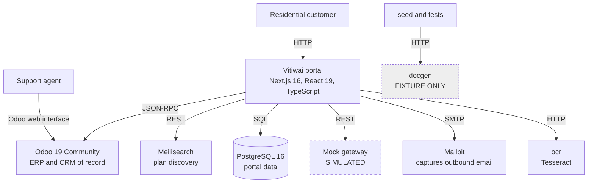
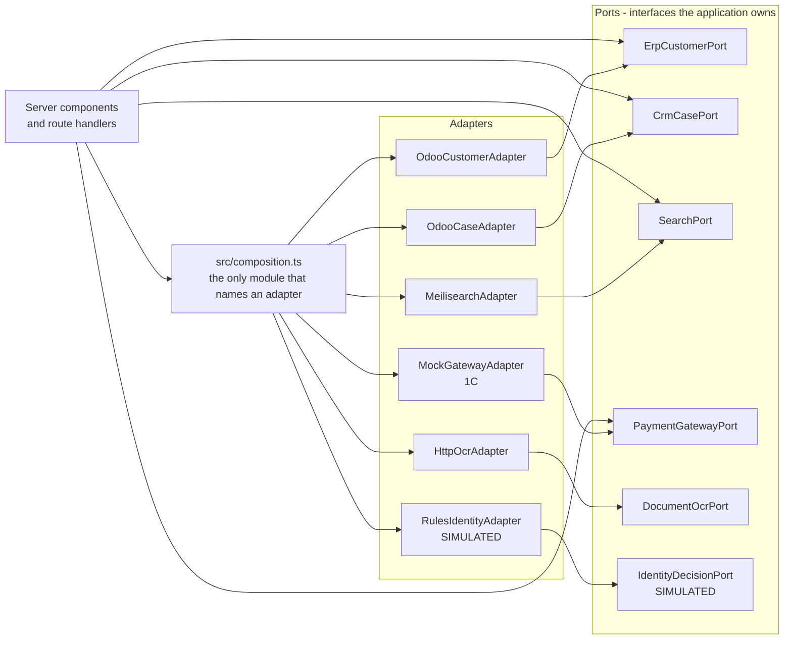

# Architecture - Vitiwai self-service portal

This describes what is built, not what is planned. Increment 1A is delivered; the workflow routes
arrive in 1B to 1E.

## Level 1 - system context

The agent has no portal interface, and will not get one. Odoo already has a good one, and building
a second is how a portal quietly becomes the system of record.

## Level 2 - ports and adapters

**The rule the code enforces:** nothing outside `src/composition.ts` may import from
`src/adapters/`. ESLint's `no-restricted-imports` fails the lint run if it does.

That boundary is the reason phase 2 is a configuration change rather than a rewrite. Replacing the
simulated gateway with a real provider means writing one new adapter and editing one line of
`composition.ts`.

## Why failure is a value, not an exception

Every port returns `Result<T, E>` rather than throwing. A route handler cannot read the success
value until it has dealt with the failure branch, because the compiler will not let it.

The alternative - throwing - lets an outside system's outage become an unhandled 500 three layers
above the call, at which point the page that knows how to explain it never runs.

## Data ownership

| Data | Owner |
|---|---|
| Customers, invoices, payments, leads, support cases | **Odoo.** The portal reads and writes through the ERP ports |
| Portal sign-in credentials, sessions, onboarding applications and payment records | **The portal's own PostgreSQL**: `portal_user`, `onboarding_application` from 1B; `portal_session` and `payment` from 1C |
| The plan catalogue, for search | **Meilisearch**, indexed from the seed |

An in-progress account application deliberately does not live in Odoo. An abandoned application is
not a customer, and writing one into the ERP pollutes it.

**No table holds an uploaded identity document.** The extracted text and the decision are kept,
because a reviewer needs them; the image is read and discarded inside the request. A contract test
asserts no `bytea` column exists, so the absence is enforced rather than remembered.

## Who is signed in

Sessions are server-side. The cookie holds 256 bits of opaque randomness and encodes nothing, so
it cannot be decoded or tampered into another user's session. Signing out deletes the row, which
kills the session everywhere rather than only in the browser that asked - a signed token could not
do that without a revocation list, which is the same database read by another name.

`requireSession()` is the guard, and every `/account` route calls it. Middleware also redirects an
unauthenticated visitor, **but it is not the control**: it can only see that a cookie exists, so a
route added later that forgets the guard must fail closed on its own.

Every account read is scoped by the session's own `odoo_partner_id`. No route takes a customer
identifier from the request, which is what stops one customer reading another's bills.

## Money

Money is an integer count of minor units - cents - with a branded type so a bare number cannot be
passed by mistake. The only place a float is tolerated is reading a value back from Odoo, which
reports currency as a float; `fromOdooFloat` converts at the boundary.

## What is simulated

`PaymentGatewayPort` and `IdentityDecisionPort` are bound to simulations, and always are in
phase 1. Each is labelled in three places: on the screen where a user meets it, in the README,
and in a comment on the adapter that implements it.
